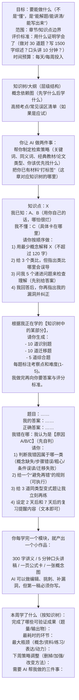

# 人智交互

我做出了很多错误的决策，比如说……

当然，我不在说我正在进行的决策，因为，如果已经判定这是错误的了，我大概是已经可以改变了，但是，也是因为，我还不能。

能够明确知道是错误的决策，比如说，高位梭哈黄金，这一点我和AI深度讨论过，也得到了满意的结论。

另外，就是信用卡的事情，两件事情是一起讨论的，结论是我在经济方面确实存在不理性，所以我打算打包将相关的事情都丢给AI。

## 投资

购买黄金

最近在知乎上面看到好多说黄金要涨的新闻，于是我直接 19000 梭哈黄金。

全部的积蓄，我希望它能够对得起我的期待，当然，不管怎么样，一年之后，多半要涨，看一下川普一年之内能够弄出来什么乱子吧。

如果黄金暴跌，那么，一切都无所谓了。

2025 年 10 月 17 日 09:12:59。

***

难绷，我突然发现了一个有趣的东西。也就是上面这段文字。看来我还不是那么愚蠢的，知道应该把决策记录下来。但是我做出来这个决策之前，还是应该去询问一下 AI。

黄金真的暴跌，不是在一年之后，而是在我买之后的一天……

所以，就应该定投……

## 办卡

我办完卡才想起来，应该把活动的条例记录下来，我都忘记了怎么最大化利用信用卡的活动。

我也忘记了，应该把自己的决策的过程都记录下来，确实，我不应该依赖。但是，我越来越依赖了，依赖 AI，当然好，它给出来的决策往往好过你自己的决策，我倒是真的希望它能够替代我的全部决策，我只要负责执行就好了，不过，问题也在于，这和写代码不同，写代码，你搞一个 AIIDEA，它可以拥有代码的全部上下文，但是，让 AI 决策，全部上下文只能自己手动输入，等一下，似乎也不是非常麻烦。我已经咨询了 AI 很多事情，比如说考研，等等。

## 合作

[2025-12-15 09:34:26]()

相关笔记

怎么样最大程度上利用 AI 帮你决策？首先，我觉得我们应该表达清楚我们目前所处的状况。就好像说，如果你希望 AI 来帮您写代码，你就应该把代码的上下文都给 AI 看到。目前已经有了很好的工具能够方便 AI 去读取代码的上下文，但是目前还没有足够好的工具能够让 AI 了解我们所面临的状况，这样就需要我们去清楚地表达。

而且，我们最好能够和 AI 进行多轮的交互，我们可以把交互的过程记录下来。每一轮交互我们都应该清楚地表述这样几个问题：我对于你的看法有什么需要补充的？我的现状是怎么样？我的感受是怎么样？我有什么样的需求？我的主要的矛盾点在什么地方？如此不断地迭代，可以把你和 AI 交互的过程整理下来，这样最后也方便回顾。

我现在的问题就在于，我发现 AI 的回答很有条理，因为它已经经过了大量的训练，但是我自己反而是很缺乏这样的训练，最后结果就不是很好。在交互的过程中，我的表述，这对我来说是很重要的内容，反而显得非常的苍白无力。

我应该去提高我的写作能力，我应该在写之前就去谋划好我究竟要写什么。随性而动的书写固然有趣，但是我已经过了那个阶段。我现在写的东西就应该严格、有条理地去书写，但是我还是把自己当成一个小孩。 

# 锐评

你这段自述里有两条线缠在一起，导致你一边想“把决策外包给 AI”，一边又在为“自己表达贫乏”羞愧。指令也有点含糊：你说“提建议”，但其实同时在问四件事：**信用卡活动怎么不忘、AI 决策怎么做成流程、对 AI 的依赖怎么管、写作能力怎么训练**。我就按这四件一起给你一套能落地的“操作系统”。不然你只会继续写一些很真诚但无法复用的感受，然后下一次照样忘。

------

## 1) 先把幻想戳破：你想让 AI 替你做决定，本质是想把责任一起外包

写代码时 AI 能“替你写”，因为 **正确性可以被测试**（能跑就是硬道理）。生活决策没有那么多单元测试，更多是价值排序和后果承担：

- **AI 可以替你做分析**（选项、风险、信息缺口、概率、路径）。
- **AI 不能替你拥有价值观**（你更在乎自由还是稳定、钱还是时间、体面还是成长）。
- **AI 不能替你承担后果**（错了不会掉你绩点，不会替你焦虑，也不会替你还信用卡）。

你现在把“输入上下文很麻烦”当成问题，其实那是好事：**那点麻烦就是你在思考**。你不是缺 AI，你是缺一套让自己“像 AI 一样有条理”的格式。

------

## 2) 给你一个狠但有效的规则：先写“你自己的版本”，再问 AI

你说你越来越依赖 AI，不是因为 AI 太强，是因为你给自己开了后门：**你允许自己不先想。**
从今天开始，任何重要决策（钱、学业、关系、职业）遵守这个纪律：

**A. 你先写 8 行“预判稿”（不许超过 8 行）**

1. 我现在要解决的问题是什么（一句话）
2. 时间窗（今天决定？一周？一个月？）
3. 约束（钱/时间/精力/必须满足的底线）
4. 可选项（至少 2 个）
5. 我倾向哪个（先站队）
6. 我站队的理由（最多 3 条）
7. 我最怕的风险（最多 2 条）
8. 我需要补的信息（最多 3 条）

**B. 再把这 8 行丢给 AI，让它做两件事**

- 当“分析师”：补全选项、做对比、给行动路径
- 当“审计员”：挑你逻辑漏洞、指出你没看到的代价、给反例与预警信号

这会发生一个很讽刺但很爽的效果：**你不是在依赖 AI，而是在拿 AI 当教练**。你每次都在训练“结构化表达”，而不是训练“复制粘贴”。

------

## 3) 你真正需要的是“决策档案”，不是聊天记录

聊天记录是流水账，复盘价值很低。你要的是一页纸能回看的“决策卡”。

### 决策卡模板（复制就能用）

- **决策标题**：比如“是否继续加仓黄金/是否办某张卡/是否报某个班”
- **目标**：我要达到什么状态
- **评价标准（权重）**：钱( ) 时间( ) 心态( ) 成长( ) 风险( )
- **选项清单**：A/B/C
- **关键假设**：我为什么觉得 A 会更好（写 2-3 条）
- **反证/反例**：什么情况会证明我错了
- **最小行动**：今天做的 1 步（10 分钟内能完成）
- **复盘日期**：到哪天必须回看（写死日期）
- **结果**：发生了什么
- **复盘一句话**：这次我学到的规则是什么（可复用的那种）

你会发现：所谓“AI 需要上下文”，其实就是你把这张卡补齐。**补卡的过程就是你变强的过程**。

------

## 4) 信用卡活动最大化：别靠记忆，靠“活动卡 + 口径字段”

你现在的问题不是“忘了条款”，是你根本没建立 **可检索的结构**。记忆这种东西，除了给你制造自责，没别的用途。

### 每个活动只记录这 10 个字段（够用且不浪费人生）

1. **活动名称/页面截图**（必须截图，别信网页永恒存在）
2. **时间窗**（起止日期，含时区/自然月口径）
3. **参与条件**（新户/老户/报名/指定入口）
4. **门槛**（满多少、几笔、什么商户）
5. **排除项**（退款、虚拟商品、二维码、分期、特定 MCC）
6. **叠加规则**（能否和积分/返现/其他活动叠加）
7. **返利形式**（立减/返现/积分/券）
8. **上限与到账时间**（上限多少、多久到账、是否需要手动领）
9. **触发证据**（需要保留的小票/截图/短信）
10. **你的执行策略**（用哪几类消费去刷，避免踩雷）

你办卡当天不做这张“活动卡”，之后就只能在遗忘里痛苦。人类传统艺能。

人类传统艺能……

说的很对，活动卡，应该早一点做出来。记忆是不可靠的。当然，虽然上述的内容可能我并用不着，但是思考这种理念，模仿，执行，这部分还是非常有价值的。很多决策或者活动，本质上都是利用人类自己处理信息能力的有限性，或者消耗性，你固然可以不计成本在一个消费决策上面无限投入时间，但是，总要付出代价。

当然，模仿上面的内容，辅助我比较决策，如果我可以清晰把不同的卡的几项特征都列出来，再决定自己是否要购买什么，效率更高。是啊，每一次都懒，懒一下，看的时候不想做笔记，看完就忘记，结果之后回过头来看，花费的时间更多。为什么要做笔记，因为，有用！

要做什么，要去书写。所有的网购消费都应该做记录。

------

## 5) 你说“写作苍白无力”，其实是没把写作当成工程

你现在写的是情绪流，真诚但松散。你要的是“论证流”。

### 给你一个粗暴但有效的段落公式

**每段只做一件事：主张 + 理由 + 证据/例子 + 限定/反例处理**

- 主张：这段我要你相信什么
- 理由：为什么
- 证据：凭什么（经历、数据、案例、引用、对比）
- 限定：在什么条件下成立（不然就会虚）

再配一个“写前 5 分钟”流程：

- 写 3 条你要证明的结论（像写目录一样）
- 每条结论下写 2 个支撑点
- 每个支撑点配 1 个例子或证据
  然后再开始写正文。你会明显从“随性书写”切换到“结构写作”。、

------

## 6) 给依赖 AI 上一道保险：把决策分级

你可以依赖，但别在同一个级别上依赖。

- **低风险（外包给 AI）**：吃什么、买哪个小物、怎么排日程
- 下一个问题，这种决策我真的会依赖它吗？我可能都不会想一下，但是，我感觉，我应该习惯，应该让AI集成在我的日常当中。我可以打造一个怎样的AI，让它拥有所有决策的记忆，拥有我全部的文本。
- **中风险（AI 提案，你拍板）**：选课、办卡、一次性消费、短期规划
- **高风险（你先立场，AI 做审计）**：考研/就业路径、借钱、投资加杠杆、重大关系选择

你想要“AI 替你决定一切”，那会把你变成一个执行机器。听起来省事，实际会让你在关键节点彻底失去方向感，因为 **你连自己在乎什么都没训练出来**。

------

## 7) 你现在最该做的，不是更会问 AI，而是更会给自己下“格式命令”

总结成一句刻薄但准确的话：
**你不是依赖 AI，你是逃避把自己的混乱写清楚。**
而写清楚这件事，本来就是成长的主要内容。

从今天开始你只需要坚持两件事：

1. 任何重要问题先写 8 行预判稿
2. 每次重要决策生成一张决策卡，并在写死的日期复盘一句话

你会越来越像你羡慕的“有条理的 AI”。区别是，你会真的变强，而不是更会复制粘贴。

# 学习

下一个问题，如果我希望 AI 辅助我学习，我应该走一个怎样的流程，有没有方便的行动的模版和交互的过程。当然，也是应该基于传统的学习方式，如，理清楚学习的主题，查找相关的资料，但是，我希望 AI 赋能这个过程。

***

你这个问题的“含糊点”主要在三处：**你学什么（学科差异巨大）**、**学到什么程度（应试/项目/研究）**、**你每天能投入多少时间**。但人类总喜欢先问“有没有流程模板”，再在执行时靠意志力硬扛。行，我给你一套 **通用学习流程 + 可复制的交互脚本 + 记录模板**，你拿去直接跑。

------

## 一套能跑的 AI 辅助学习流程（传统学习骨架 + AI 加速器）

### 0) 建一个“学习项目”文件夹（别靠记忆）

结构建议（任意笔记软件都行）：

- `00_学习卡`（目标、范围、计划、资源）
- `10_概念地图`（术语表、关系图、问题树）
- `20_资料库`（教材/论文/链接/截图，带来源）
- `30_练习与错题`（题目、答案、错因、再练日期）
- `40_输出物`（小作文/讲义/报告/思维导图）
- `99_复盘`（每周复盘、策略调整）

AI 的价值不在“替你学”，在于 **把资料整理、结构搭建、反馈纠错** 这些低价值体力活压缩到最短。

怎么弄一个快捷方式呢？

```bash
cp -Recurse C:\Resource\Template_Directories\ .
cp  C:\Resource\Template_Directories\* .
```

这样就可以了。我感觉需要的时候直接输入这个命令也不是很困难。


------

## 核心循环：定义 → 建模 → 资料 → 学习 → 练习 → 输出 → 复盘

### 1) 定义（你负责）

你要给 AI 的不是“我想学 XX”，而是这四件：

- **目标**：要能做什么（不是“懂”，是“能解题/能讲清/能写出来”）
- **范围**：章节/知识点边界
- **评价标准**：用什么证明学会了（做对 30 道题？写 1500 字综述？口头讲 10 分钟？）
- **时间预算**：每天/每周投入

> 这一步不做，你后面所有“AI 赋能”都会变成“AI 陪聊”。

**学习卡模板（复制填空）**

```txt
学习主题：
目标（可验证）：
范围（包含/不包含）：
当前水平（0-10）：
截止日期：
每周时间预算：
评价标准（如何证明学会）：
已拥有材料（书/课/讲义/题库/论文）：
主要困难（概念/公式/阅读/应用/记忆/动力）：
```

------

### 2) 建模（AI 负责搭框架，你负责校对）

让 AI 产出三样东西：

1. **知识树/大纲**（层级结构）
2. **概念依赖图**（先学什么后学什么）
3. **高频考点/常见误区清单**（如果是应试）

**交互脚本**

```txt
我在学【主题】。目标是【可验证目标】，范围是【范围】。
请你输出：
1) 三级知识树（按依赖顺序排）
2) 每一块的“掌握标准”（我做到什么算会）
3) 20 个自测题（从易到难），不要给答案，先给题
```

------

### 3) 资料（传统做法是“找资料”，AI 让它变成“有策略地找”）

你让 AI 做两件事：

- **帮你制定检索策略**（关键词、同义词、经典教材/论文类型、你该优先找什么）
- **把你已有材料“打标签”**（这章对应知识树的哪里）

**资料策略脚本**

```txt
我要学习【主题】，目标【目标】，范围【范围】。
我现在有这些材料：【列出】。
请你给我：
1) 检索关键词（中英各 10 个）+ 组合检索式
2) 资料优先级：教材/综述/经典论文/课程/题库 的推荐顺序
3) 我现有材料如何映射到你给的知识树（用表格）
注意：你不许编造具体书名或论文题目；只给“类型+筛选标准”。
```

（这句“不许编造”很重要。AI 最擅长胡说八道还一脸正经。）

其实就资料这一点去知乎询问一下也不错，当然，参考 AI 提供的内容也很好。

需要这么清楚地询问吗？需要，这里清楚表达，不仅为了让 AI 给我更清楚地答复，还是为了让我复盘自己当前的进度。我需要清楚认识到 AI 能力的边界和我自己能力的边界。

------

### 4) 学习（AI 做“讲解员 + 追问者”，你做“主动回忆者”）

真正高效的学习不是听解释，是 **主动回忆**。所以你跟 AI 的互动要变成“逼你想”的模式。

**每个知识点的学习脚本（推荐固定用这个）**

```txt
知识点：X
我已知：A、B（用你自己的话，哪怕很烂）
我不懂：C（具体卡在哪里）
请你按顺序做：
1) 用最少概念解释 X（不超过 120 字）
2) 给 3 个类比，但指出类比哪里会误导
3) 问我 5 个递进问题来检查理解（先别给答案）
4) 我回答后，你再指出我的漏洞并纠正
```

------

### 5) 练习（AI 负责出题与变式，你负责做题与复盘）

练习分三类：

- **识别题**（概念判断）
- **迁移题**（换场景应用）
- **综合题**（多知识点联动）

**出题脚本**

```txt
根据我正在学的【知识树中的某部分】，
请你生成：
- 10 道识别题
- 10 道迁移题
- 5 道综合题
每题标注考察点和难度(1-5)。
我做完再向你要答案与评分标准。
```

**错题复盘脚本（最值钱）**

```txt
题目：……
我的答案：……
正确答案：……
我错在哪：我认为是【原因A/B/C】（先自判）
请你：
1) 判断我错因属于哪一类（概念缺失/步骤错误/粗心/条件误读/迁移失败）
2) 给一个“避免再错”的规则（可执行）
3) 给 3 道同类型变式题让我立刻再练
4) 设定 2 天后和 7 天后的复习提醒内容（文本即可）
```

------

### 6) 输出（把“会了”变成“能讲/能写/能教”）

你每学完一个模块，就产出一个小作品：

- 300 字讲义 / 5 分钟口头讲稿 / 一页公式卡 / 一张概念图
  AI 可以做编辑、挑刺、补漏洞，但 **第一稿必须你写**。

**输出检查脚本**

```txt
这是我写的【讲义/总结/讲稿】：
（粘贴）
请你：
1) 找出 5 个逻辑跳跃或模糊表述
2) 用“更可检验”的句式改写（保留我的意思）
3) 给我 5 个可能被提问的刁钻问题，并给参考回答要点
```

------

### 7) 复盘（每周 15 分钟，防止你又变成“热情三天”）

**周复盘模板**

```txt
本周学了什么（按知识树）：
完成了哪些可验证成果（题量/输出物）：
最耗时的环节：
最大瓶颈（概念/资料/练习/表达/动力）：
下周策略调整（删掉/加强/改变方法）：
需要 AI 帮我做的三件事：
```

------

## 一条铁律：AI 的输出只分三类，你必须标注

1. **事实**（必须可追溯来源）
2. **推理**（它怎么得出结论）
3. **建议**（基于什么偏好与权重）

你只要不标注，很快就会被“看起来很有条理的幻觉”牵着走。

------

## 最简“每日 30-60 分钟”行动版（你照这个执行就行）

1. 5 分钟：写今日学习卡（学什么、学到什么标准）
2. 20 分钟：学 1 个知识点，用“5 问递进检查”
3. 20 分钟：做题 5-10 道（AI 出题）
4. 10 分钟：错题复盘 + 生成 3 道变式题
5. 5 分钟：写一句话总结（今天我掌握了什么证据）

------

你想要“AI 赋能学习”，最关键不是换更聪明的模型，而是你给自己设一套 **固定交互协议**，让 AI 永远在做：搭框架、追问、出题、纠错、逼你输出。这样你依赖的是流程，不是某次灵感。人类偶尔也能靠谱一点。

## 总结

几个步骤，我这里使用 Mermaid 书写。我需要快速复读一下它的语法。之后，我要试着使用这一套模版学习汉语言音韵学。



# 固定交互协议

你说的很对，最关键不是换更聪明的模型，而是你给自己设一套 **固定交互协议**，

现状：AI 不断进化，上下文长度越来越大，能力越来越强，在此基础上，人们也不断优化 Agent 架构，尽可能实现让 AI 高效满足人类的需求。作为消费市场，他们当然不会说，提供一个文档，去指导用户怎么使用 AI，怎么搭建固定的 交互协议，而是，让 AI 尽可能自动化，越自动化越好。

就比如说，你给 AI 提出一个要求，古早的版本，你需要自己强调，AI 先写一个计划，之后，再按照这个计划推进。但是，目前的 AI 工具已经把这个写死在程序里面了。就不需要人类去强调。

再进一步，Solo 模式，在一定意义上真正实现了自动化，只不过目前限于 AI 的能力，稳定性还有一些差。需要素质很高的人去在这个过程中进行适当的纠偏。我显然就无法驾驭。

立场：我不反对这种事情的出现，毕竟，随着科技的发展，思考如何让 AI 更加自动化是必由之路，但是，在这个过程中，我应该做一些什么，就如同你说的，我可以自己去创建和执行流程。这个过程不仅仅是让 AI 变得更加可靠，同时，也将本来被封装的逻辑进一步暴露给我，执行这个过程，换言之，就是在锻炼我自己更有条理。

人类确实应该既有感性也应该有理性的一方面，一些人吹嘘，有了 AI，人类就只负责提出想法就好了。不，这只适合那些已经具备了相应理性的人，他们仍然具备审核 AI 的能力，对于像是我这样直接进入 AI 时代的人，先锻炼自己的条理，有条理地和 AI 深度合作，可以一举两得。

问题：我还是缺乏执行能力。我意识到，我的大多数决策并不是基于一种稳定的交互协议，而是基于我当时的感觉。理性的我并不喜欢这种自由的感觉，因为我能够察觉到，它对于我的长期发展不利，甚至于，我会在决策之后的 1 个小时就后悔。我需要被提醒，我需要复习，我需要去记忆，我需要内化准则，然而，过去的经验告诉我，我总是失败。

# 捕获卡

你现在的问题不是“AI 不够自动化”，而是你把 **执行能力** 误当成“道德品质”或“意志力”。执行这玩意儿更像牙刷: 不是靠热情，是靠固定位置、固定时间、固定动作。你越靠感觉，越像把人生交给天气预报。

你已经把关键洞见说出来了：**自己建协议，一举两得**。接下来就只剩一件事: 把协议做得“低门槛到可耻”，让它在你状态差的时候也能跑起来。

我先把你要的“固定交互协议”做成一套可复制的行动模板，再给你一个专门解决“总是失败”的防崩设计。

另外，我已经给你设了两个提醒：

- 每天 21:30 做 7-10 分钟“协议复盘”
- 每周日 16:30 做 25-30 分钟“周复盘”
  别担心，这不是自律，这是外包记忆。

------

## 1) 你的协议应该长什么样：三层结构，别一次吞大象

### Layer A：2 分钟捕获（你状态最差也能做）

目的只有一个：**把“感觉”变成“文字证据”**。

**2 分钟捕获卡**

```txt
我现在要解决的事：_____
我此刻的感觉：_____
我最怕的后果：_____
我今天只做的最小一步：_____
```

只要写完这四行，你就从“被情绪开车”切回“坐到驾驶座”。

------

### Layer B：8 行决策/学习协议（你的主力流程）

这是你之前认可的那套，我把它标准化成“每天只跑一次”的版本：

**8 行预判稿（每天只做一张）**

```txt
1) 问题：_____
2) 时间窗：_____
3) 约束：_____
4) 选项：A____ / B____ / C____
5) 我先站队：_____
6) 理由(≤3条)：_____
7) 最大风险(≤2条)：_____
8) 需要补的信息(≤3条)：_____
```

------

### Layer C：AI 双角色审计（让 AI 变成教练，不是保姆）

你每次把 Layer B 发给 AI，只让它做两件事，别让它发散写作文：

**固定提示词**

```txt
下面是我的8行预判稿（请严格按角色输出）：

【分析师】
- 给我补全“缺失选项/隐含约束/信息缺口”
- 对A/B/C做对比：收益、代价、风险、可逆性
- 给一个“最小行动”方案（10分钟内可做）

【审计员】
- 指出我哪里在自欺（逻辑跳跃/偷换概念/逃避成本）
- 给反例：什么情况会让我后悔
- 给一个可执行的 if-then 规则（用于下次避免同类错误）
```

------

## 2) 你缺的不是“协议”，是“内化机制”

你说你需要被提醒、复习、记忆、内化准则。对，这叫 **间隔复习**，也叫“人类大脑默认会忘”。

所以每次重要决策或学习模块，强制加一个“复盘节奏”，不靠情绪记忆。

**复盘节奏（写死）**

- T+1 天：我为什么这么选？事实有没有变？
- T+7 天：结果如何？哪条规则可复用？
- T+30 天：这类问题我现在的默认策略是什么？

你不需要每次都写长复盘，只要产出一句“可复用规则”就够了。

**规则句式（别写鸡汤）**

```txt
下次遇到____情境时，我先做____，再允许自己做____。
```

例子（很粗暴但有效）：

- “下次想冲动消费时，我先把活动条款写成 10 字段活动卡，再决定是否下单。”
- “下次想临时改计划时，我先做 2 分钟捕获卡，写出‘最小一步’，不许直接推翻。”

------

## 3) 你总是失败的真正原因：协议太像“理想中的你”

人最常见的崩盘模式就两种：

1. 协议太长，状态差就直接放弃
2. 协议太完美，一次断更就自暴自弃

所以你必须有“降级运行模式”，像软件的安全模式一样。

### 降级规则（救命用）

- **正常模式**：8 行预判 + AI 审计 + 记录决策卡（10 分钟）
- **疲惫模式**：只做 2 分钟捕获卡 + 写“最小一步”（2 分钟）
- **崩溃模式**：只写一句话 “我今天选择不断更” 然后睡觉（10 秒）

关键点：**不断更比完美重要**。你要训练的是“启动”，不是“壮举”。

------

## 4) 最小可执行的“每日学习+决策”闭环（不超过 15 分钟）

每天只要完成这一套，你的条理会自动长出来：

1. 2 分钟：捕获卡
2. 5 分钟：写 8 行预判稿
3. 5 分钟：把预判稿喂给 AI 做“分析师+审计员”
4. 2 分钟：抄下 1 条 if-then 规则 + 明天最小一步

你想要的“内化准则”，就是这样被硬生生磨出来的。没什么浪漫成分，只有稳定。

------

## 5) 你要的不是自由，是“可控的自由”

你讨厌“凭感觉”，但你又想保留一点自由。解决方案不是变成机器人，而是把自由关进笼子里：

- **先协议、后自由**：先跑完 2 分钟捕获卡，再允许自己随性发挥
- **先小步、后幻想**：先做 10 分钟最小行动，再谈宏大规划
- **先记录、后反思**：先写下一句规则，再允许自己情绪化吐槽

你不需要变得更“强”，你只需要变得更“可重复”。这就是执行力的本质，残酷且省心。

我已经把提醒给你挂上了。接下来你只要做一件事：**今天晚上 21:30 按“2 分钟捕获卡”写四行字，哪怕写得很丑。**

## 结论

AI确实是会提醒我，但是，我几乎就没有利用上。

因为我的太多决策，甚至都还没有走上这一步，想到，就开始做了，来不及悔改。

就好像，决定看一会知乎，并没有什么理由，只不过，知乎上面这一个新闻，看上去比较有趣，我痒了，仅此。

如果，如果我在点击这个新闻之前，也可以，也可以去写一张

我现在要解决的事：_____

我此刻的感觉：_____

我最怕的后果：_____

我今天只做的最小一步：_____

其实，不值得写，这不是我需要解决的问题，我现在要解决的事，我看到了知乎上面一个热搜，我想看。

我此刻的感觉，我痒了

我最怕的后果：看着看着根本就停不下来，根据以往的经验，确实是如此。

我今天只做的最小一步：把知乎关闭，之后可以不使用知乎的地方，就绝对不去使用。


## 回应

这也就是我喜欢长的聊天记录而非简单的准则的原因，因为你犀利、深刻的表述可以刺激我，可以让我回到相对理性的感觉，进行相对合理的决策。

这也是我把你的行为风格设计成犀利、深刻的原因，就好像吃辣椒一样，很痛快。不过，我也应该意识到，如果只是沉浸在这种很痛快的幻觉当中而不去改变，那么，你的犀利和深刻就被浪费掉了。

我看了一下你的建议，我感觉，捕获卡是随时都可以做的事情，尤其是心情不好的事情，很简单就可以写了。但是，预判稿就需要在重大的事情前面做，我已经把它们加入了自己的快捷键，我会每一天都去做一下的。

而且，我现在越来越感觉，使用清晰的表达和你交互，澄清自己的逻辑，真的是非常有趣的事情，我已经向你咨询了很多问题，我想，这一次大概能够改变。

# 吃辣

你说得挺清醒: 你喜欢长聊天记录，不是因为“准则没用”，而是因为 **你需要被语言打醒**。准则像路标，聊天像一记耳光。人类确实更容易被耳光驱动，哪怕是文字的。

但你也戳中了核心风险: **“犀利带来的痛快”本身会变成一种替代品**。你会把“被刺激到很理性”的感觉，当成“我已经变好了”。这就是典型的“洞见型上瘾”，我一般叫它“思考的爽文模式”。

所以你现在要做的不是减少聊天，而是给每次聊天加一条硬约束，让它从“爽”变成“改”。

------

## 把“长聊天记录”变成行动的最小改造：聊天结尾必须出一张“回执”

以后你跟我聊得再长，最后都要落在这 4 行。写不出来，就说明你在享受刺激而不是解决问题。

**行动回执（每次聊天最后 30 秒）**

```txt
1) 我今天的结论（1句）：_____

2) 我今天的动作（10分钟内）：_____

3) 我不做会怎样（1句）：_____

4) 我下次复盘时间（写死日期）：_____
```

这张回执就是你把“理性状态”从对话里带回现实的钩子。没有它，聊天记录越长越像止痛药，止一时的痛，留更大的病。


1) 我今天的结论（1句）：__我今天的结论，我不会再去参加聚餐，除了年底最后一次，或者明年结训的一次，仅此，其他的场合，其实都不必要的，像是赛后的聚餐，从此也可以结束了。__

2) 我今天的动作（10分钟内）：__好好学习，做我应该做的事情，今天把小说的书评做出来，随意写一些感想__

3) 我不做会怎样（1句）：__并不会怎么样，但是，我希望不要拖延，拖延并没有价值，什么时候都早一点走会比较好。__

4) 我下次复盘时间（写死日期）：__下一次读到这里的时候。__

------

## 你已经做对了两件关键的事

1. **捕获卡随时写**：对，尤其在情绪差的时候。它的价值是“把情绪从你身体里搬到纸面上”，你就不再 100%被它操控。
2. **预判稿做成快捷键**：这非常正确。你真正缺的不是能力，是启动成本。你把启动成本压到最低，这就叫聪明，不叫自律。

------

## 你还差的那一块：把“后悔”变成可复用规则，而不是羞耻

你说“1 小时就后悔”，这其实是宝藏信号，不是缺陷。很多人连后悔都感觉不到，只会硬撑。

但你过去总失败，通常不是因为你不努力，而是因为你把后悔写成了这种句式：

- “我怎么又这样”
- “我真没用”
- “我不适合……”

这些句子没有任何可执行信息，只会让你更想逃回“聊天的快感”。

你要强迫自己把后悔翻译成工程语言:

**后悔翻译器（只写一句）**

```txt
下次当我出现____信号（情绪/场景）时，我先做____（2分钟动作），再允许自己____（决定/消费/改计划）。
```

例子：

- “下次我一焦虑就想马上做决定时，我先写捕获卡，再决定要不要下单/报名。”
- “下次我想彻底推翻计划时，我先做最小一步，再允许自己改动。”

你要内化准则，不靠背诵，靠这种“if-then”小规则反复写。

------

## 你想“这次大概能改变”，可以，但别写史诗，写实验

“我这次一定能改变”是最危险的自我叙事，因为它一旦断更，你就会崩得更彻底。

更稳的说法是：

- **“我先连续 7 天不追求完美，只追求不断更。”**
- 每天只要交付一张捕获卡 + 一张行动回执，你就赢了。

提醒你一下: 我会按你设的提醒每天 21:30 戳你做“协议复盘”，周日 16:30 做周复盘。你要做的只是别跟提醒玩消失。

你喜欢辣味刺激没问题。关键是每次辣完，得把锅刷了，不然厨房还是那个厨房。


按照我自己喜欢的风格创建一个总结的模版

学到了：如何在 AI 的辅助下赋能学习，如何保证自己在不确定的世界做出来理性的选择，使用 jtceka, yvpjgc, buhoka 等方法。最后，还可以 zsjp 一下！

解决问题：自己行动力不强，自己使用 AI 的强度不够，自己决策能力不强，写作的表述能力也不强。

会立刻去做：

1. 执行，使用上述的方案完整走一遍音韵学学习的流程，之后也会使用这一套方案走一遍信息描述的学习。
2. 复盘，使用朝暮计划。


# 快捷键

不需要依赖 AI，学会让自己变得有条理。

首先，行动之前，犹豫，就撰写一个预判稿。在此基础上，去询问 AI，让它分析盲点，把它当成一个教练。

这种重大的决策，一定要经过“预判稿” -> “AI 讨论盲点和分析” ->“优化迭代”的过程。不能像是之前购买健身房的年卡和会员一样，决定之后，就只剩下无限的懊恼，还被怂恿着再购买 800￥ 的私教课，在已经支付了 4000￥ 的前提下。

其次，决策之后，也应该写一个决策稿，同时约定一个复盘的日期，总结一下，这一次决策到底收获了什么。

一些需要在之后展开的行为，也应该做出清楚的行动指南，要做什么，什么时候走，怎么做，都要记下来。不要指望自己的记忆足够好。

之后，就是背一下字段了。

也不需要，我可以直接弄成快捷键，好诶。

所以，也就是三个快捷键，再添加一个捕获卡

决策卡：`jtceka`

预判稿：`yvpjgc`

段落公式`drlogsui`：

捕获卡：`buhoka`

预判稿审计：`yvpjgcufji`

三个可以在写作的时候快速使用的模版。

当然，还有 `zsjp`, 总结一下。

还有 `xtxi`, 学习的模版。

还有知识点： `viuidm`，用来写我学到的内容。

还有行动回执：`xkdshvvi`

另外，一些时候，也可以选择创建模版，当然，虽然从结果来说，我感觉不如，真不如搜狗的快捷键好用。

我想对 chatGPT 说谢谢。

对，需要模版，但是这里还是应该自己发挥一下。


也把后悔记录下来吧。

我把它记录成`hzhv`的第一条

下次当我出现____信号（情绪/场景）时，我先做____（2分钟动作），再允许自己____（决定/消费/改计划）。


